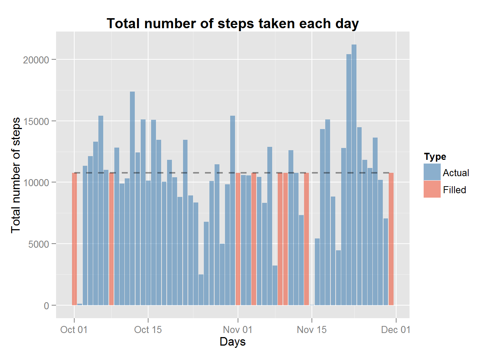

#Reproducible Research
###Peer Assesment I

##Introduction

It is now possible to collect a large amount of data about personal movement using activity monitoring devices such as a Fitbit, Nike Fuelband, or Jawbone Up. These type of devices are part of the "quantified self" movement - a group of enthusiasts who take measurements about themselves regularly to improve their health, to find patterns in their behavior, or because they are tech geeks. But these data remain under-utilized both because the raw data are hard to obtain and there is a lack of statistical methods and software for processing and interpreting the data.

This assignment makes use of data from a personal activity monitoring device. This device collects data at 5 minute intervals through out the day. The data consists of two months of data from an anonymous individual collected during the months of October and November, 2012 and include the number of steps taken in 5 minute intervals each day.

These are the R libraries that will be used:

```{r Libs}
library(ggplot2)
library(plyr)
library(knitr)
library(xtable)
```

##Data

## Loading and preprocessing the data

The data for this assignment can be downloaded from the course web site:
  
```{r DataDownload}
if(!file.exists("./RR_Project1")){dir.create("./RR_Project1")}
setwd("./RR_Project1")
fileUrl <- "http://d396qusza40orc.cloudfront.net/repdata%2Fdata%2Factivity.zip"
download.file(fileUrl,destfile="Project1_DATA.zip")
unzip("Project1_DATA.zip")
```

Dataset: Activity monitoring data [52K]

```{r DataGet}
DataFrame <- read.csv("activity.csv",
    colClasses = c("integer", "Date", "integer"),
  	na.strings = "NA")

str(DataFrame)
```

The dataset is stored in a comma-separated-value (CSV) file and there are a total of 17,568 observations in this dataset.
The variables included in this dataset are:

- steps: Number of steps taking in a 5-minute interval (missing values are coded as NA)
- date: The date on which the measurement was taken in YYYY-MM-DD format
- interval: Identifier for the 5-minute interval in which measurement was taken

```{r DataStruct, results = "asis"}
xt <- xtable(summary(DataFrame))
print(xt, type = "html")
```

##Assignment

###What is mean total number of steps taken per day?

For this part of the assignment, we can ignore the missing values in the dataset.

```{r A01-01}
DF <- DataFrame[complete.cases(DataFrame),]
```

Let's calculate first the total number of steps taken each day

```{r A01-02}
SumStepsByDay <- data.frame(  
    Date = unique(DF$date), 
    AverageSteps = as.numeric(tapply(DF$step, DF$date, sum)))

Stats1 <- data.frame(
    Stats = c("Mean w/o NAs", "Median w/o NAs", "Variance w/o NAs"), 
    Values = c(mean(SumStepsByDay$AverageSteps),median(SumStepsByDay$AverageSteps),var(SumStepsByDay$AverageSteps)))
```
The mean of total number of steps is: `r Stats1[1,2]`, the median: `r Stats1[2,2]`

```{r A01-03, results = "asis"}
Table1 <- xtable(Stats1)
print(Table1, type = "html")
```
# 
Below the code to print the barchart of total number of steps taken each day. although this is requested by the assignment, I think it helps to understand better the data structure. The dotted line is the mean of total number of steps taken per day

```{r A01-04}
  	ggplot(data = SumStepsByDay) +
			 geom_bar(	aes(x = Date, y = AverageSteps),
					stat = "identity", 
					fill =  "steelblue",
					alpha = 0.6) +
			 geom_line(	aes(x = Date, y = mean(AverageSteps)),
					linetype = "dashed", 
					size = 0.8,
					colour = "black", alpha = 0.4) + 
  		 	 xlab("Days") +
			 ylab("Total number of steps") +
  		  	 ggtitle("Total number of steps taken each day") + 
			 theme(plot.title = element_text(face = "bold"))
```


Histogram of the total number of steps taken each day. The dotted line is the mean of total number of steps taken per day

```{r A01-05}
  	ggplot(data = SumStepsByDay) +
			 geom_histogram(	aes(x = AverageSteps),
						binwidth = max(SumStepsByDay$AverageSteps)/9, 
						colour = "gray90", 
						fill =  "steelblue",
						alpha = 0.6) +
   			 geom_vline(	aes(xintercept = mean(AverageSteps)),
						linetype = "dashed", 
						size = 0.8,
						colour = "black", alpha = 0.4) + 
  		 	 xlab("Total number of steps") +
			 ylab("Frequency (Nr. of days)") +
  		  	 ggtitle("Histogram of total number of Steps per day (w/o NAs)") + 
			 theme(plot.title = element_text(face = "bold"))
```


### What is the average daily activity pattern?

Let's calculate average number of steps taken, averaged across all days 

```{r A02-01}
AvgStepsByInterval <- data.frame(
    Interval = unique(DF$interval), 
    AverageSteps = as.numeric(tapply(DF$step, DF$interval, mean)))

MaxStepsByInterval <- AvgStepsByInterval[AvgStepsByInterval$AverageSteps == max(AvgStepsByInterval$AverageSteps),]	

print(MaxStepsByInterval)
```

The 5-minute interval, on average across all the days in the dataset, that contains the maximum number of steps is `r MaxStepsByInterval[[1]]` (time interval corresponds to 13:55)

Below a time series plot (using ggplot2) of the 5-minute interval (x-axis) and the average number of steps taken, averaged across all days (y-axis). The dotted line highlights the 5 minutes interval with the maximum average number of steps. 

```{r A02-02}
  	ggplot(data = AvgStepsByInterval) + 
			geom_line( 	aes(x = Interval, y = AverageSteps),
					linetype = "solid", 
					size = 1.2,
					colour = "steelblue", alpha = 0.7) + 
			geom_area( 	aes(x = Interval, y = AverageSteps),
					fill = "steelblue", alpha = 0.2) + 
   			geom_vline(	aes(xintercept = MaxStepsByInterval[[1]]),
					linetype = "dashed", 
					size = 0.8,
					colour = "black", alpha = 0.4) + 
  		 	xlab("5-minute intervals") +
			ylab("Average Nr. of steps (across all days)") +
  		  	ggtitle("Average Nr. of steps per 5-minute interval") + 
			theme(plot.title = element_text(face = "bold"))
```


### Imputing missing values

There are a number of days/intervals where there are missing values (coded as NA). The presence of missing days may introduce bias into some calculations or summaries of the data.

Calculate and report the total number of missing values in the dataset (i.e. the total number of rows with NAs):

```{r A03-01}
str(DataFrame)
sum(is.na(DataFrame)[,1]); mean(is.na(DataFrame)[,1])
```

The total number of NAs is `r sum(is.na(DataFrame)[,1])` that corresponds to the `r mean(is.na(DataFrame)[,1])*100`% of the total number of observations

Let's devise a strategy for filling in all of the missing values in the dataset. 

First let's create a database with the missing values:

```{r A03-02}
Nas <- DataFrame[!complete.cases(DataFrame),]
tapply(Nas$interval, Nas$date, length)
NasDates <- unique(Nas$date); length(NasDates)
```
We can see that the values missing are the values of `r length(NasDates)` missing full days:

```{r A03-03}
print(NasDates)
```
I will fill the interval missing values with the mean of the 5-minute intervals averaged across all days.

```{r A03-04}
FilledSteps <- round(rep(AvgStepsByInterval$AverageSteps,length(NasDates)))
```
Now, the two dataset are merged to create a new dataset that is equal to the original dataset but with the missing data filled in. A new factor variable "type" is added to the dataset tho flag the data as "Actual" or "Filled"

```{r A03-05}
DFActual <- DF
    DFActual$type <- as.factor("Actual")

DFFilled <- Nas 
    DFFilled$steps <- FilledSteps
    DFFilled$type <- as.factor("Filled")
		
DataFrameFilled <- rbind(DFActual, DFFilled)
    DataFrameFilled <- DataFrameFilled[order(DataFrameFilled$date, DataFrameFilled$interval),]
		
str(DataFrameFilled)
```

Let's calculate the average number of steps taken, averaged across all days.

```{r A03-06}
SumFilledStepsByDay <- data.frame(  Date = unique(DataFrameFilled$date), 
    AverageSteps = as.numeric(tapply(DataFrameFilled$step, DataFrameFilled$date, sum)),
    Type = as.factor(as.character(tapply(DataFrameFilled$type, DataFrameFilled$date, function(get){as.character(get[1])}))))
		
Stats2 <- data.frame(
    Stats = c("Mean Filled", "Median Filled", "Variance Filled"), 
    Values = c(mean(SumFilledStepsByDay$AverageSteps),median(SumFilledStepsByDay$AverageSteps),var(SumFilledStepsByDay$AverageSteps)))
```
The mean of total number of steps is: `r Stats1[1,2]`, the median: `r Stats1[2,2]`

```{r A03-07, results = "asis"}
Table2 <- xtable(Stats2)
print(Table2, type = "html")
```
# 
Below the code to print the barchart of total number of steps taken each day. although this is requested by the assignment, I think it helps to understand better the data structure. The dotted line is the mean of total number of steps taken per day

```{r A03-08}
  	ggplot(data = SumFilledStepsByDay) +
			 geom_bar(	aes(x = Date, y = AverageSteps, fill = Type),
					stat = "identity", 
					alpha = 0.6) +
			 geom_line(	aes(x = Date, y = mean(AverageSteps)),
					linetype = "dashed", 
					size = 0.8,
					colour = "black", alpha = 0.4) + 
			 scale_fill_manual(values = c("steelblue","tomato2")) +
  		 	 xlab("Days") +
			 ylab("Total number of steps") +
  		  	 ggtitle("Total number of steps taken each day") + 
			 theme(plot.title = element_text(face = "bold"))
```



Histogram of the total number of steps taken each day. The dotted line is the mean of total number of steps taken per day

```{r A03-09}
  	ggplot(data = SumFilledStepsByDay) +
			 geom_histogram(	aes(x = AverageSteps),
						binwidth = max(SumFilledStepsByDay$AverageSteps)/9, 
						colour = "gray90", 
						fill =  "violetred4",
						alpha = 0.6) +
   			 geom_vline(	aes(xintercept = mean(AverageSteps)),
						linetype = "dashed", 
						size = 0.8,
						colour = "black", alpha = 0.4) + 
  		 	 xlab("Total number of steps") +
			 ylab("Frequency (Nr. of days)") +
  		  	 ggtitle("Histogram of total number of Steps per day (filled)") + 
			 theme(plot.title = element_text(face = "bold"))
```


The chart below compares the Histograms of filled DataFrame (purple) and Dataframe w/o Nas (blue). The two charts are overlapped. 

```{r A03-10}
  	ggplot() +
			 geom_histogram(	data = SumFilledStepsByDay,
						aes(x = AverageSteps),
						binwidth = max(SumFilledStepsByDay$AverageSteps)/9, 
						colour = "gray90", 
						fill =  "violetred4",
						alpha = 0.6) +
			 geom_histogram(	data = SumStepsByDay,
						aes(x = AverageSteps),
						binwidth = max(SumStepsByDay$AverageSteps)/9, 
						colour = "gray90", 
						fill =  "steelblue",
						alpha = 0.6) +
   			 geom_vline(	data = SumStepsByDay,
						aes(xintercept = mean(AverageSteps)),
						linetype = "dotted", 
						size = 0.8,
						colour = "black", alpha = 0.4) + 
   			 geom_vline(	data = SumFilledStepsByDay,
						aes(xintercept = mean(AverageSteps)),
						linetype = "dashed", 
						size = 0.8,
						colour = "black", alpha = 0.4) + 
  		 	 xlab("Total number of steps") +
			 ylab("Frequency (Nr. of days)") +
  		  	 ggtitle("Histograms of total number of Steps (filled and w/o NAs)") + 
			 theme(plot.title = element_text(face = "bold"))
```


From the chart above we can see that the histogram of the filled database (Purple) shows more density around the mean. The purple histogram shows more frequency in the range that includes the mean and shows less dispersion. This was expected as the filled values are the averages of the 5-minute intervals averaged across all days. The estimates of the total daily number of steps will be closer to the average value of actual data.

below the statistics compared:

```{r A03-11, results = "asis"}
Stats3 <- rbind(Stats1,Stats2)
Table3 <- xtable(Stats3)
print(Table3, type = "html")

```
###Are there differences in activity patterns between weekdays and weekends?

Creates a new factor variable in the dataset with two levels - "weekday" and "weekend" indicating whether a given date is a weekday or weekend day.

```{r A04-01}
Days <- weekdays(DataFrameFilled$date)
    Days[which(Days == "Saturday" | Days == "Sunday")] <- "Weekend"
    Days[which(Days != "Weekend")] <- "Weekday"

DataFrameFilled$day <- as.factor(Days)

AvgFilledStepsByInterval <- ddply(DataFrameFilled, c("interval","day"), function(df)mean(df$steps))
names(AvgFilledStepsByInterval) <- c("Interval", "Day", "AverageSteps")

summary(AvgFilledStepsByInterval, digits = 7)
```
Makes a panel plot containing a time series plot of the 5-minute interval (x-axis) and the average number of steps taken, averaged across all weekday days or weekend days (y-axis).

```{r A04-02}
  	ggplot(data = AvgFilledStepsByInterval) + 
			geom_line( 	aes(x = Interval, y = AverageSteps),
					linetype = "solid", 
					size = 1,
					colour = "violetred4", alpha = 0.7) + 
			facet_wrap( ~ Day, nrow=2) +
			geom_area( 	aes(x = Interval, y = AverageSteps),
					fill = "violetred4", alpha = 0.1) + 
  		 	xlab("5-minute intervals") +
			ylab("Average Nr. of steps (across all days)") +
  		  	ggtitle("Average Nr. of steps per 5-minute interval") + 
			theme(plot.title = element_text(face = "bold"))
```
